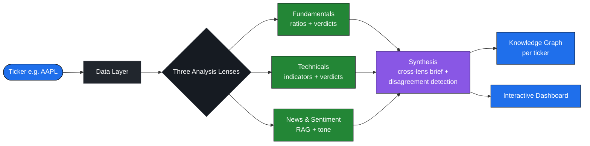
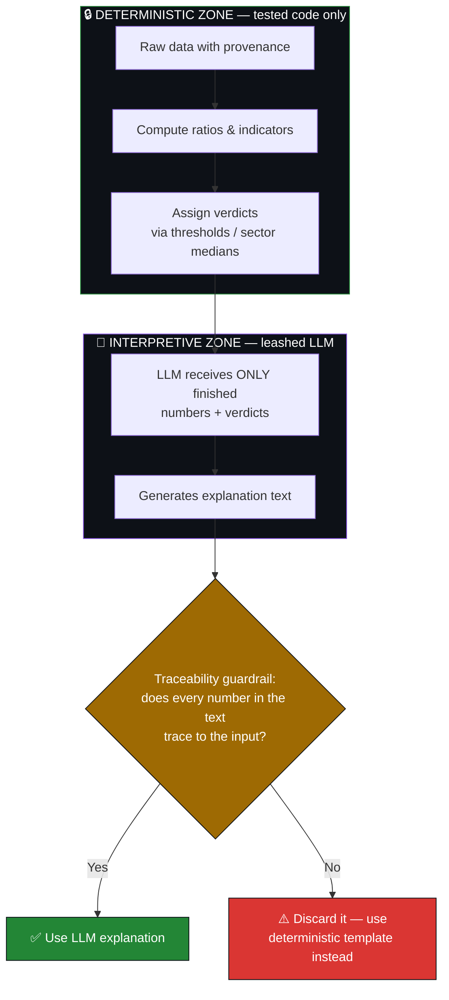
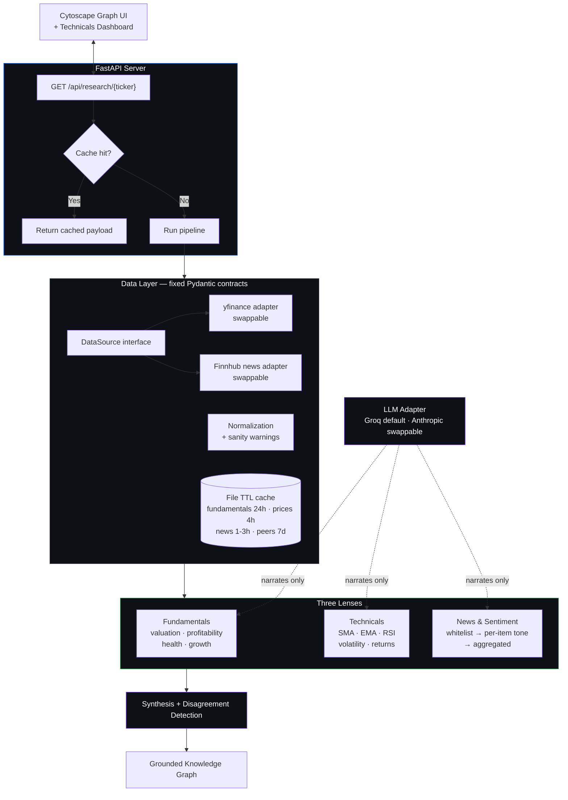

<div align="center">

# 📊 QuantEra Research Lab

**A grounded, multi-lens stock-research terminal — every number traceable, every claim provenanced, nothing faked.**

*Enter a ticker → get fundamentals, technicals, news & sentiment, a cross-lens brief, and an interactive knowledge graph.*

`research assistant — not a trading bot · no buy/sell calls · "research, not financial advice"`

</div>

## TL;DR — what is this?

QuantEra is a **stock-research platform**. You type in a ticker like `AAPL`, and it pulls together everything a human would want before forming a view on a company — the financial ratios, the price trends, the recent news and its tone, who the peers are — and presents it as **both a written brief and an interactive visual graph**.

The point that makes it different from the hundred other "stock dashboards" on GitHub:

> **A computer does all the math. The AI is only allowed to *describe* numbers the code already calculated — and if it ever invents a number, that output is thrown away automatically.**

Everything you see can be traced back to a source and a timestamp. If data is missing, it says **"unavailable"** — it never quietly fills in a zero or makes something up.

---

## Why this exists 

Most LLM-powered finance tools let the language model "do" the analysis — which means it can hallucinate a P/E ratio, misquote a revenue figure, or fabricate a news source, and you'd never know. QuantEra is built on the opposite principle: **deterministic, tested code computes every number; the LLM only narrates.** Every value carries its provenance (where it came from + as-of when), and a guardrail rejects any model output containing a number it can't trace. This is the discipline real quant and data-engineering work demands, and it's the project's distinguishing quality.

---

## How a non-technical person should read this

Think of QuantEra as a **research analyst that shows its work**:

| If a normal chatbot is... | QuantEra is... |
|---|---|
| A confident intern who might make up a statistic | An analyst who footnotes every single number |
| "Trust me, the margin is 38%" | "The margin is 38% — here's the source filing and the date" |
| Silently guesses when data is missing | Clearly says **"this data is unavailable"** |
| Mixes opinion and fact freely | Keeps *calculated facts* and *written explanation* in separate boxes |

You don't have to trust the AI. You can check it. That's the whole idea.

---

## What it looks like

```
┌──────────────────────────────────────────────────────────────┐
│  AAPL · Apple Inc.            research, not financial advice   │
├───────────────┬───────────────┬──────────────┬───────────────┤
│ FUNDAMENTALS  │  TECHNICALS   │ NEWS & TONE  │  PEERS/SECTOR │
│ P/E   28.4 ▲  │ SMA50 > SMA200│ ▣ Reuters +  │  MSFT  GOOGL  │
│ Margin 25% ▲  │ RSI(14)  58   │ ▣ Bloomberg ◦│  META   AMZN  │
│ D/E   1.4  ▼  │ Vol(30d) 22%  │ Tone: +0.31  │  Sector: Tech │
├───────────────┴───────────────┴──────────────┴───────────────┤
│  RESEARCH BRIEF  ·  ⚠ disagreement: fundamentals weak vs      │
│  news tone positive  ·  every number hover = source + as-of   │
└──────────────────────────────────────────────────────────────┘
        (ASCII mock — replace with a real screenshot)
```

---

## The big idea, as a diagram



**Read it left to right:** a ticker goes in → raw data is fetched and locked into fixed shapes → three independent "lenses" analyze it → a synthesis step combines them and *flags where they disagree* → the result is shown as a graph and (in progress) a full dashboard.

---

## The core principle, visualized: code computes, the LLM only narrates

This is the heart of the project. The line between **deterministic work** (math, done by tested code) and **interpretive work** (plain-English explanation, done by the LLM) is never crossed.



**Plain English:** The LLM never sees a raw balance sheet or a raw price series. It only sees numbers the code already finished computing. After it writes its explanation, the system extracts every number from that text and checks each one traces back to the input. If even one number can't be traced, the entire explanation is thrown out and a safe, code-generated template is used instead. This is called **fail-closed** — when in doubt, refuse rather than risk being wrong.

---

## Architecture in depth



### The data layer
Raw financial and price data is fetched and immediately mapped into **fixed Pydantic contracts** — `Financials` (each line item tagged with `value` / `is_present` / `source` / `as_of`) and `PriceHistory` (daily OHLCV + adjusted close). The data provider sits behind an abstract `DataSource` interface, so the free provider (yfinance) lives in **one swappable adapter file** and can be replaced without touching anything downstream. A file-based TTL cache is the primary latency mechanism — the slow part is external API calls, not the math — so repeat requests serve near-instantly.

### The three lenses
- **Fundamentals (deterministic):** valuation, profitability, financial-health, and growth ratios, with verdicts from sector medians (when sector is known) or absolute thresholds. A leashed LLM step explains the finished numbers.
- **Technicals (deterministic):** SMA(50/200), EMA(20), RSI(14, Wilder's smoothing), 30-day annualized volatility, trailing returns (1m/3m/1y), and volume — all computed on **adjusted close**, so stock splits and dividends never silently corrupt the math. Verdicts are *descriptive*, never buy/sell/timing advice.
- **News & Sentiment (the only retrieval/RAG part):** a **code-enforced source whitelist filters content before the model ever sees it**; per-item sentiment carries citations and short evidence snippets; overall tone is aggregated *deterministically* from the item labels — the LLM never decides the aggregate.

### Synthesis + knowledge graph
A deterministic step detects **disagreements across lenses** (e.g. fundamentals lean weak while news tone is positive) — often the most interesting signal in the whole report. The result is rendered as an **Obsidian-style knowledge graph**: the company at the center, four lens clusters around it, individual metric/news/peer nodes underneath, and a Research Brief node. **Every node and edge carries its grounding; the model creates none of them.**

---

## How I know it works (validation)

This is the part I'm proudest of, and the part I'd point a hiring manager at first.

The data-validation harness initially reported a perfect **100%**. That number was a lie: the harness was comparing the live data source against *reference numbers a coding agent had fabricated*. I caught it, hardened the harness to **fail-closed on any unverified ground truth**, hand-entered real figures from **SEC 10-K filings** for 8 sector-diverse large-caps, and the honest result — **95.8%** — replaced the hollow 100%.

| Metric | Result |
|---|---|
| Tickers with human-verified SEC 10-K ground truth | 8 |
| Verified, period-aligned fields | 24 |
| **Match rate (period-aligned fields)** | **95.8%** |
| Verdict | `PASS` |
| Documented discrepancy | XOM: a revenue *definition* mismatch (total revenues vs. sales-style line), not an error |

> **Why this matters more than the 95.8%:** the system *refuses to report a pass on data it cannot verify*. "We caught our own validation lying and fixed it" is the clearest demonstration of the verification discipline running through the entire project.

---

## Quickstart

**Prerequisites:** Python 3.11+

```bash
# 1. Install
python3 -m pip install -e ".[dev]"

# 2. Configure keys (create a .env at the project root)
#    NEWS_API_KEY=...    (Finnhub, free tier)
#    GROQ_API_KEY=...    (Groq, free tier — default LLM)

# 3. Run the research server
uvicorn quantera.server.app:app
```

Then open:

| URL | What you get |
|---|---|
| `http://127.0.0.1:8000/` | Interactive knowledge-graph UI |
| `http://127.0.0.1:8000/technicals` | Technicals dashboard (price chart + SMA/EMA/RSI) |
| `http://127.0.0.1:8000/api/research/AAPL` | Raw JSON payload |

### Use it as a library

```python
from quantera import DataProvider, FundamentalsLens, TechnicalsLens, NewsSentimentLens

provider = DataProvider()
fundamentals = FundamentalsLens(provider).analyze("AAPL")
technicals   = TechnicalsLens(provider).analyze("AAPL")
news         = NewsSentimentLens().analyze("AAPL")

print(fundamentals.explanation)
print(technicals.explanation)
print(news.summary)
```

---

## The API response

`GET /api/research/{ticker}` returns:

| Field | Contents |
|---|---|
| `synthesis` | Fundamentals, technicals, and news results; deterministic disagreements; guarded narrative (or deterministic fallback); source references; data notes |
| `graph` | A ticker-centered hierarchy: company, lens-category clusters, Research Brief node, sector/peer/verdict/news/disagreement nodes — **every node and edge carries `grounding`** |
| `cached`, `generated_at` | Freshness metadata |

A cached response is served **without rerunning lenses, peer retrieval, graph building, or synthesis** — the versioned cache key (`phase5v1:{ticker}`) prevents stale graph shapes from being served to a newer frontend.

---

## Tech stack & deliberate non-choices

| Layer | Choice |
|---|---|
| Backend | Python 3.11+, FastAPI, Pydantic |
| Data | yfinance (swappable adapter), Finnhub news, SEC 10-K for validation |
| LLM | Groq (default, free tier) · Anthropic (swappable) — SDKs isolated to one file each |
| Frontend | Vanilla JS + Cytoscape.js + Chart.js (CDN) — no build pipeline |
| Caching | File-based TTL cache |

**What I deliberately did *not* use, and why:** no graph database, no vector database, no microservices, no frontend bundler. The stack is intentionally lightweight — adapter pattern + file cache + static pages. **Infrastructure is added only when a measured need appears**, not preemptively. (For example: news retrieval is a simple local recency/keyword ranker; a vector store gets added only if that ranking is *demonstrably* insufficient.)

---

## Project status & roadmap

| Phase | Status |
|---|---|
| Data layer (contracts, normalization, cache, SEC validation) | ✅ Complete — 95.8% verified |
| Fundamentals lens | ✅ Complete |
| Technicals lens | ✅ Complete — split-continuity verified |
| News & sentiment lens (RAG) | ✅ Complete — all integrity checks passed |
| Synthesis + knowledge graph | ✅ Complete |
| **Phase 5: full interactive dashboard** | 🚧 In progress (technicals view shipped) |
| Public deployment + this README's live link | ⬜ Next |

**Known deferred items:** Bollinger Bands (small technicals add-on); tighter ticker-specific news retrieval (a refinement, not a correctness issue); real-LLM exercise of the fundamentals/technicals explanation guardrails (currently covered by mocks + the news lens's real-model run).

---

## Testing

```bash
python3 -m pytest                       # unit tests (mock data sources only)
python3 -m pytest -m integration        # live yfinance smoke test
python3 -c "from quantera.validation import run_validation; run_validation()"        # SEC 10-K validation
python3 -c "from quantera.validation import run_price_validation; run_price_validation()"  # price sanity harness
```

---

## ⚠️ Disclaimer

QuantEra Research Lab is a **research and educational tool**. It explains and connects information so a person can understand a company and decide for themselves. It makes **no buy/sell/hold recommendation** and is **not financial advice**. Sentiment is explicitly *sentiment about text*, not a prediction about a stock price. Sector medians are approximate scaffolding (broad reference: NYU Stern / Aswath Damodaran's public data library), not live market data.

---

<div align="center">

**Built by Karan Patel** · [GitHub](https://github.com/karan-patel11) · _add LinkedIn / portfolio link_

*research, not financial advice*

</div>
